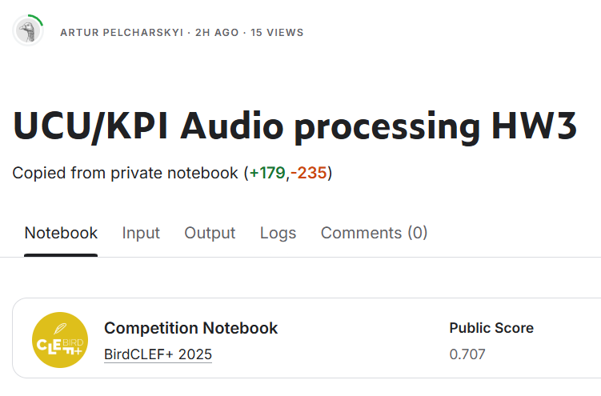

# Audio_Processing_Labs

The main analysis and final results are presented in `final_solution.ipynb`. Other notebooks, such as `solution.ipynb` and `trivial_solution.ipynb`, contain my initial, unsuccessful attempts. These early versions lack commentary and consist mostly of fragmented and somewhat disorganized code. Nevertheless, I chose to include them in the submission to illustrate the progression and development of my final approach in comparison to the earlier ones.

