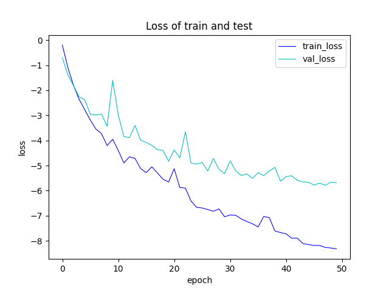

# Conv-TasNet: Speaker-Independent Speech Separation

This repository contains an implementation of [Conv-TasNet: Surpassing Ideal Time–Frequency Masking for Speech Separation](https://arxiv.org/abs/1809.07454) adapted for training and evaluation on a custom dataset. The work was done as part of a paper review.

## 🧠 About the Project

Conv-TasNet is a convolutional time-domain audio separation network that replaces traditional time-frequency transformations (like STFT) with a learnable convolutional encoder-decoder structure.

Although the original paper was released in 2019, Conv-TasNet remains an influential baseline for source separation tasks. I chose this architecture for its well-defined structure and high reported performance. The base code used was taken from this repository: [JusperLee/Conv-TasNet](https://github.com/JusperLee/Conv-TasNet), though I had to apply several bug fixes and custom modifications:
- Wrote my own evaluation loop and added additional metrics (SI-SNRi, SDRi) from the original paper
- Adjusted training logic for use with a different dataset and experimental setup

## ⚠️ Requirements
- CUDA-compatible GPU is required for training (Conv-TasNet is compute-intensive)
- Python 3.10+

## 📦 Installation

1. Clone the repository:
   ```bash
   git clone https://github.com/PelArtur/Audio_Processing_Labs/tree/main/Paper_review
    ```

2. Create a virtual environment and install dependencies:
    ```bash
    python -m venv venv
    source venv/bin/activate  # or venv\Scripts\activate on Windows
    pip install -r requirements.txt
    ```

3. Download and prepare the dataset as explained bellow.


## 📊 Dataset

Instead of using the WSJ0-2mix dataset (which is licensed and not publicly available), I used a custom dataset from Kaggle:  
📦 [Speaker Recognition Audio Dataset](https://www.kaggle.com/datasets/vjcalling/speaker-recognition-audio-dataset)

This dataset contains 50 speakers, each with ~100 one-minute clips. I created two-speaker mixtures manually to mimic the properties of the WSJ0-2mix dataset:
- Sampling rate: 8000 Hz
- Clip duration: 4 seconds
- Unique speakers per split

Mixture generation is done in [`generate_dataset.ipynb`](generate_dataset.ipynb). The final split:
- **Train:** 5000 mixtures from speakers `00–39`
- **Validation:** 500 mixtures from speakers `40–44`
- **Test:** 1000 mixtures from speakers `45–49`

Note: The total training data duration (~5.5 hours) is about **6× smaller** than in the original work.

## 🏗️ Code Structure

- `conv_tasnet.py` – Model architecture implementation  
- `si_snr_utils.py` – SI-SNR and SDRi metric/loss functions  
- `trainer.py` – Training, validation, and evaluation logic  
- `conv_tasnet.ipynb` – Full analysis, training, and testing notebook  
- `generate_dataset.ipynb` – Code to generate the mixture dataset

## 🧪 Results



| Metric   | My Model | Original Paper |
|----------|----------|----------------|
| SI-SNRi  | **7.35 dB** | 15.3 dB        |
| SDRi     | **6.08 dB** | 15.6 dB        |

> Note: My model was trained for 50 epochs (vs. 100 in the paper) and on significantly less data due to computational constraints. Nevertheless, the model showed strong learning behavior and stable loss convergence.

## 📎 Citation
If you use this implementation or dataset setup in your research, please consider citing the original Conv-TasNet paper:

```BibTeX
@article{Luo_2019,
   title={Conv-TasNet: Surpassing Ideal Time–Frequency Magnitude Masking for Speech Separation},
   volume={27},
   ISSN={2329-9304},
   url={http://dx.doi.org/10.1109/TASLP.2019.2915167},
   DOI={10.1109/taslp.2019.2915167},
   number={8},
   journal={IEEE/ACM Transactions on Audio, Speech, and Language Processing},
   publisher={Institute of Electrical and Electronics Engineers (IEEE)},
   author={Luo, Yi and Mesgarani, Nima},
   year={2019},
   month=aug, pages={1256–1266} }
```
